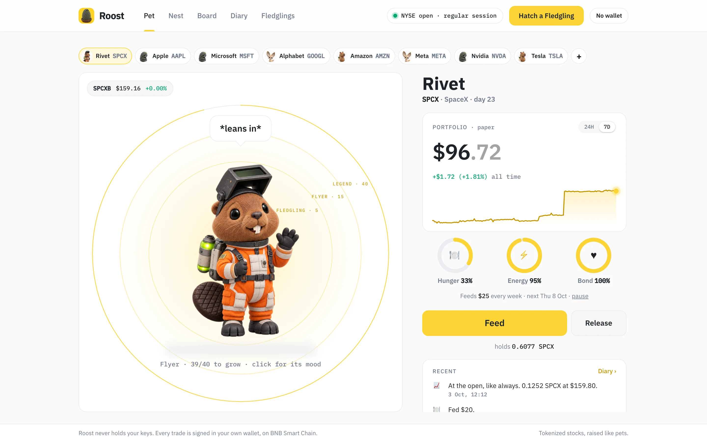
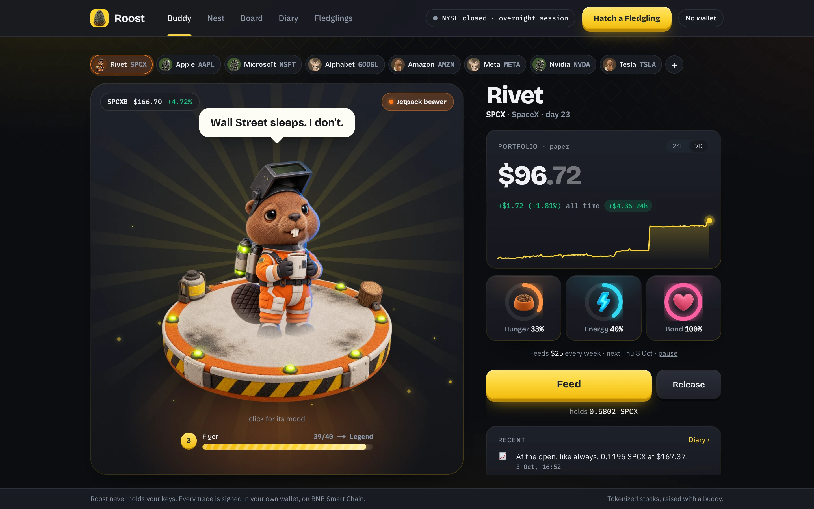
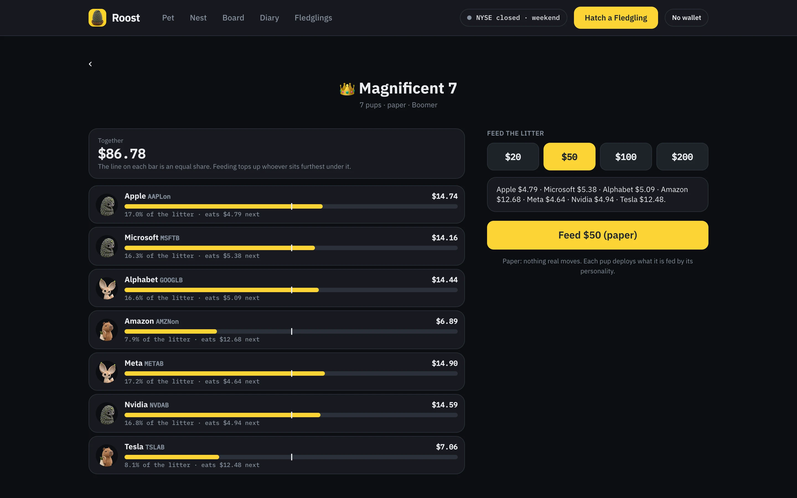
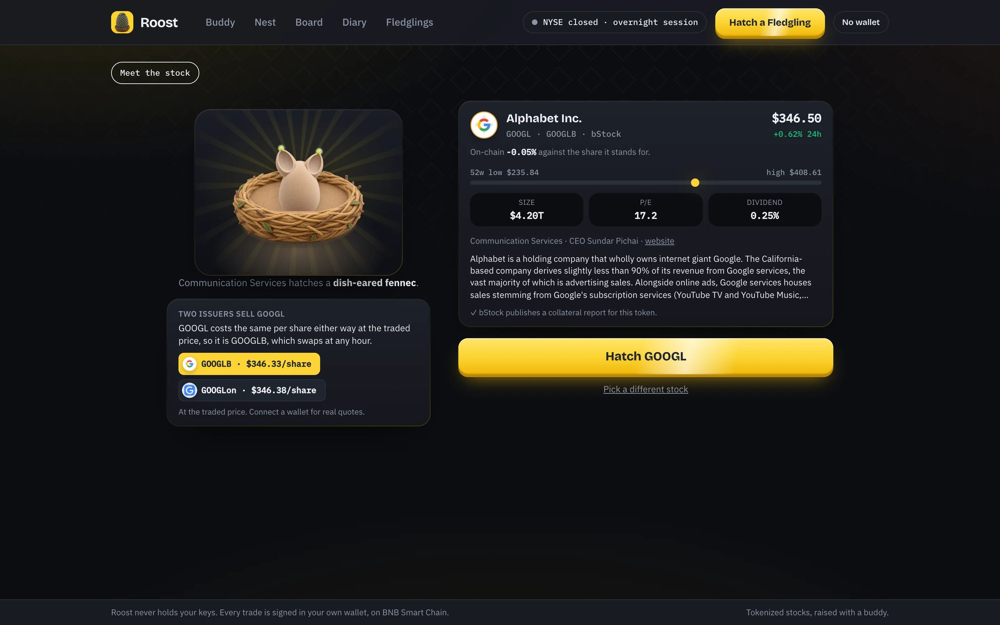
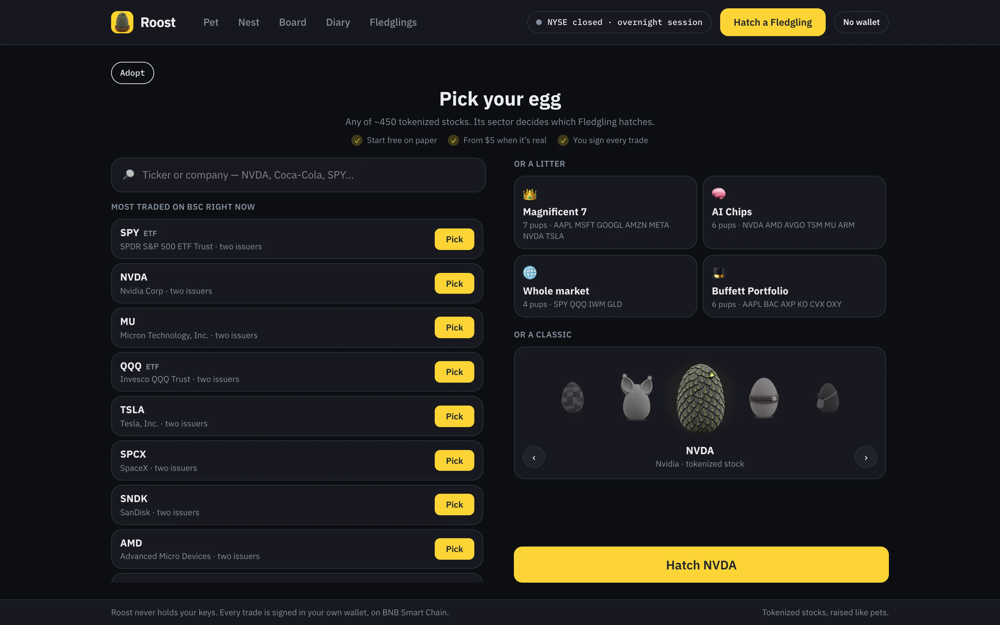
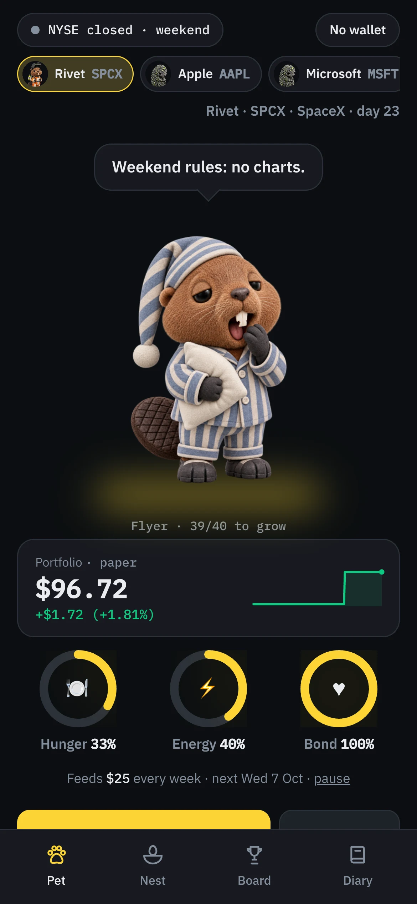
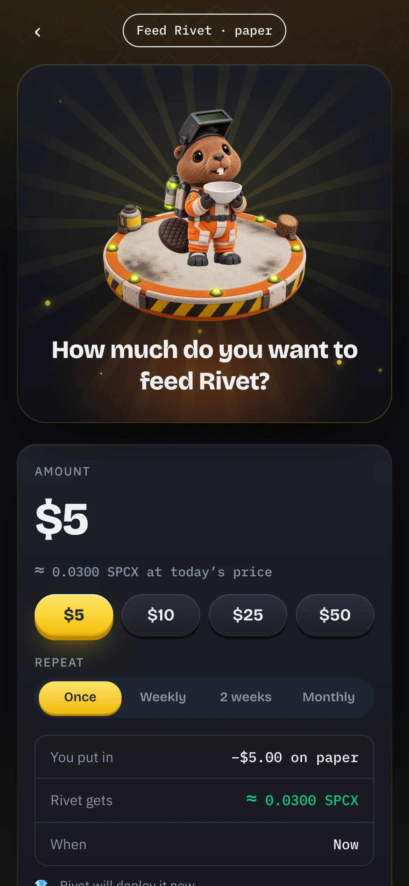
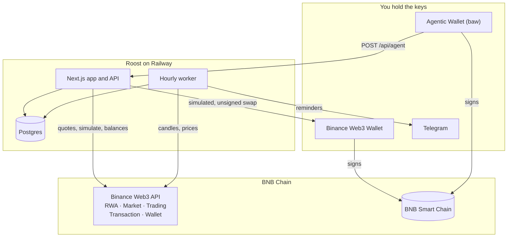

<p align="center"></p>

<h1 align="center">Roost</h1>

<p align="center"><b>Tokenized stocks, raised with a buddy.</b><br/>
Adopt a Fledgling — a creature that is also a trading rule — feed it USDT, and it buys real tokenized equities on BNB Smart Chain, from your own wallet.</p>

<p align="center">
<a href="https://roost.nerom.site"><b>Open the live app →</b></a> ·
<a href="skills/roost">Agentic Wallet skill</a> ·
<a href="roostsignal">Agent Studio seller agent</a> ·
<a href="#what-we-measured-on-bsc">What we measured</a>
</p>

<p align="center">Built for <a href="https://www.bnbchain.org/en/hackathons/tokenized-stocks">BNB Hack: Tokenized Stocks Edition</a> · BSC mainnet · spot only · non-custodial</p>



## Try it in a minute

1. Open **[roost.nerom.site](https://roost.nerom.site)** — phone or desktop, no wallet needed to start.
2. **Pick a pod.** Search any of the ~450 tokenized stocks and ETFs on BSC, hatch a whole themed **litter** (Magnificent 7, AI Chips, Buffett Portfolio…), or take one of the six classics.
3. **Name it and choose a personality.** The personality *is* its trading strategy.
4. **Feed it.** Without a wallet it trades on paper, and says so everywhere. Connect Binance Web3 Wallet before adopting and every feed is a real swap you sign.
5. **Come back tomorrow.** An hourly worker keeps it trading while the app is closed, and it tells you what it did — in its diary, or on Telegram.

## Why a buddy

A tokenized stock trades every hour of the week. The exchange behind it is open about **32 hours in 168**. For the other 136 the reference price stopped moving on Friday afternoon while the token kept trading. That gap is what a tokenized stock *is*, and it is surprisingly hard to measure honestly — see [what we measured](#what-we-measured-on-bsc).

A buddy makes it felt rather than explained:

- **It lives on the market's clock.** The app has a day and a night in Binance's colours — its light theme while the NYSE trades, its dark one while it sleeps — switched by the real session, holidays included. At the close the room goes dark and its stage lights up. There is a mood only a 24/7 chain can have — **Night Owl**: *"Wall Street sleeps. I don't."*
- **Its mood is the market.** Eight moods from the live print, the session and how hungry it is. Hunger and session outrank price, so care is never masked by a green day.
- **Its personality is its strategy.** 💎 *Diamond Hands* deploys at every open and never sells. ⚡ *Degen* hunts 2% dips at any hour. 🕰 *Boomer* trades regular hours only and keeps 20% back. 📊 *Quant* rebalances weekly and cites basis points. 🌙 *Night Shift* buys only while Wall Street sleeps, and only under the last close. 🏄 *Trend Rider* adds weekly, and only to a stock already above its five-day average.
- **It rewards habits, not hype.** Feeding days, a streak that forgives a missed day, growth from care — and no confetti for trading.

| | |
|---|---|
|  |  |
| **Night Owl.** The exchange is shut; the token is not. | **Litters.** Fed as one — whoever is furthest behind eats first. |
|  |  |
| **The cheaper share.** Two issuers, one share — it picks, and says why. | **Any stock.** The sector decides which Fledgling hatches. |

## What it does

- **Any of ~450 tokenized stocks and ETFs.** Search by ticker or company, read a company card — sector, CEO, 52-week range, P/E, dividend, the issuer's collateral report, and how far the token trades from the share it stands for — and hatch it. The sector picks the creature: Technology a circuit pangolin, Energy a copper axolotl, Consumer and Healthcare a shopping capybara, Industrials a jetpack beaver, ETFs a patchwork sheep, Communication and Financials a dish-eared fennec.
- **The cheaper share.** Most big names are sold by two issuers — bStock's `NVDAB` and Ondo's `NVDAon` — at different prices. On hatching, the buddy prices one share through each (real fills for your wallet when connected), picks the cheaper, and writes why in its first diary line. On 29 Sept the price feed called GOOGL and QQQ a tie; real fills made **bStock's 1.26% and 1.40% cheaper per share**.
- **Litters.** Magnificent 7, AI Chips, Whole market and Buffett Portfolio hatch as several pups sharing a personality and a wallet. Each feed is a **rebalance with new money**: it tops up whoever sits furthest below an equal share, and nothing is sold to make room.
- **Real, non-custodial trades.** A live feed is a real swap signed in *your* wallet — simulated first, exact approvals only, refused if the price is bad, and recorded from the chain's receipt. [How →](#roost-never-holds-your-keys)
- **Release.** Sell some or all back to USDT through the same checks, with FIFO cost basis and realized P&L.
- **A nest.** Keep several Fledglings and litters; one portfolio view, real money and paper counted apart.
- **Habits, not hype.** Weekly, fortnightly or monthly **feeding days** (missed ones are skipped, never stacked into a catch-up buy); a free daily **scratch**; a streak that **forgives one missed day a week**; growth from Hatchling to Legend by days visited and feeding days kept — never by returns or deposit size. When a token's share ratio rises, a dividend was reinvested, and the buddy says it grew. Confetti is for hatching and care milestones only.
- **It keeps going without you.** An hourly worker replays the same deterministic engine against the real hourly tape, keeps paper feeding days, and writes the diary. A buddy waiting on your yes/no is skipped: the permission rule holds when nobody is watching.
- **Board and duels.** A leaderboard by today's move, all-time P&L or care — the care ranking never counts money — and 24-hour duels between Fledglings that neither owner can trade during, with the top three on a podium and the closest race up front.
- **A buddy on Telegram.** Feeding-day reminders with a **Sign it** button, the buddy's own buy requests, and `/buddies` to check in. It never trades from the chat.
- **Phone and desktop.** A thumb-first phone app with a tab bar; on a wide screen, an exchange-style top bar with the market clock and the wallet, and every page laid out two-up — the buddy standing on its own habitat on a lit stage, beside its numbers, the market and what it did lately.

<p align="center">&nbsp;&nbsp;&nbsp;</p>

## Built on the BNB Chain stack

| Piece | What Roost does with it | Where |
|---|---|---|
| **RWA Data API** | The 448 tickers, reference prices, share ratios, market status, company profiles and market data | [`lib/quote`](src/lib/quote.ts), [`lib/company`](src/lib/company.ts) |
| **Market API** | The traded price, 24h change and hourly candles the engine trades on | [`lib/quote`](src/lib/quote.ts), [`lib/bars`](src/lib/bars.ts) |
| **Trading API** (aggregator) | Real fills, unsigned swaps and approvals, the issuer comparison | [`lib/preflight`](src/lib/preflight.ts), [`lib/issuer`](src/lib/issuer.ts) |
| **Transaction API** (`simulate`) | Every live buy and sale is simulated against the signing wallet first | [`lib/preflight`](src/lib/preflight.ts) |
| **Wallet API** | USDT, BNB and token balances behind a wallet; on-chain holdings | [`lib/preflight`](src/lib/preflight.ts), [`/api/holdings`](src/app/api/holdings/route.ts) |
| **Binance Web3 Wallet** | Signs every live trade in the web app (wagmi 3, EIP-6963) | [`lib/trade`](src/lib/trade.ts) |
| **Agentic Wallet + Wallet Skills** | The buddy decides; the owner's own agent executes it with `baw` | [`skills/roost`](skills/roost) |
| **BNB Agent Studio** | A Fledgling as a seller agent that sells the spread, per ticker and per issuer | [`roostsignal`](roostsignal) |

All signing lives in [`lib/binance`](src/lib/binance.ts), which builds the wire path once and uses that one string for both the signature and the request, and paces calls in the lanes the gateway actually enforces.

## Roost never holds your keys

Roost decides; something the user controls executes. There is no server-side key at any layer, and there should not be one.

**In the app,** a Fledgling is bound to the wallet connected at adoption. Feeding a live one:

1. Roost asks the aggregator for this wallet's swap and **simulates it** with the Transaction API against current chain state, reading the USDT and BNB behind it from the Wallet API.
2. It **refuses a bad price**: a fill more than 3% over the token's own reference (or a sale 3% under) is not a trade — some off-hours pools are broken, and a quote does not warn you.
3. If an approval is needed, it asks for **exactly this amount**, to exactly the router that will spend it.
4. You sign the swap — the transaction that was simulated, unchanged.
5. The diary is written from the **receipt's Transfer logs** and linked to BscScan — never from the quote. Roost records no trade the chain did not.

Or fund it and let its rule decide: when the rule fires, the buddy asks for a signature instead of pretending it traded.

**With the Binance Agentic Wallet** ([`skills/roost`](skills/roost)) — MPC-keyless, signed into from the Binance App by QR, driven through the `baw` CLI inside limits set in the App — `POST /api/agent` returns the Fledgling's decision as one of four instructions: a `swap` carrying the exact `baw` command, an `ask`, a `hold`, or a `blocked`. The owner can also just say "feed it $5" and it eats at once, at any hour. Every `swap` comes back simulated against the wallet that would sign it, and the skill carries Binance's own rule: an `orderId` is not a completed swap — poll to `FINISHED` or `FAILED` before reporting anything.

**On BNB Agent Studio** ([`roostsignal`](roostsignal)), a Fledgling is a seller agent — ERC-8004 identity, ERC-8183 task interface, A2A, MCP and x402 — that sells the gap: `/api/signal` reports it for **all 448 tokenized tickers**, and for the 40 two issuers list, where the same share executes best. Its first rule is that every number comes from a tool call.

## What we measured on BSC

Everything below was found against the live Binance Web3 API, and is reproducible with a script in this repo.

**The RWA endpoint cannot give you the spread.** `tokenPrice` and `referencePrice` sit in the same row, but `tokenPrice / (referencePrice × tokenToShareRatio)` is exactly `1.000` for **all 488 listed tokens** — `referencePrice` is derived, not an independent tape. Difference the two and you report a perfectly efficient market, always, including at 3am on a Sunday. The traded leg has to be a real aggregator quote. (`npm run check:quotes`)

**`tokenToShareRatio` is not optional.** Skip it and a 10:1 token reports a **900%** spread — `NFLXon`, `PPLTon` and `KLACon` all do.

**A price is not a fill.** On Tuesday 29 Sept, pre-market, the price feed put GOOGL and QQQ within 0.04% across issuers. Real $25 buy quotes for one wallet made **`GOOGLB` 1.26% cheaper per share than `GOOGLon`, and `QQQB` 1.40% cheaper than `QQQon`**. That is why the buddy asks for fills rather than reading prices.

**The same stock from two issuers is two prices and two references.** bStock and Ondo both list 40 tickers on BSC. Quoted both ways on a Saturday (`npm run cross`):

- **No arbitrage worth the name.** All 17 pairs quotable on both sides lost money before gas — 0.02% to 1.1% at $100.
- **But a real routing choice.** NVDA cost **2.1% more to buy as `NVDAon`** than as `NVDAB`; SPCX 2.0% more, widening to 3.6% at $500. bStock's weekend round trip was a median 0.23% and never above 0.6%.
- **The references disagree** — NVDA 224.18 vs 224.80 per share at the same instant, IBM 2.2% apart. There is no single reference price; each issuer carries its own.
- **Off-hours, Ondo is mostly shut and partly broken.** 16 of 40 Ondo tokens refused to quote, 5 had no liquidity at $100, and 4 quoted from broken pools — `MSFTon` offered a buy 196 million percent over its reference, and was still doing it three days later. Roost keeps any side more than 5% from its own issuer's reference out of every answer.

**`priceImpactPercent` is a fraction, not a percent.** `0.946` is a 94.6% impact — `SNDKon` filled 97% under its reference with exactly that in the field. A guard written as `impact > 1` passes a fill that loses 95%. `tradeFee` is the swap's gas in USD (~$0.03), not taken out of the quoted amount.

**Simulate catches what a quote cannot.** Twelve wallets that had just used the aggregator's router, each asked to buy $1 of NVDAB: eleven would have reverted — six on balance, five on allowance — and every one had a perfectly good quote. The endpoint has no reference page yet; its body is `{ binanceChainId, evmTx: { from, to, value, data } }`, and anything else returns an error naming `evmParams`, a field that does not exist.

**The rate limit is shared, and a burst looks like a replay.** The docs say five requests a second per endpoint. Measured, the RWA endpoints share *one* budget of about three a second, while the aggregator took four quotes a second cleanly. And identical signed requests in the same millisecond are refused as a replay — `401`, `40103`, *"Duplicate request detected"*. So every call leaves [`lib/binance`](src/lib/binance.ts) in a paced lane, loads are single-flight, and a rate-limited lookup is never cached as an answer.

**The gateway's sharp edges.** The signed path must carry the `/build` prefix. The chain parameter is `binanceChainId`, not `chainId`. Failures come back as **HTTP 200** with the error in the body's `code`. Candle `bar` is lowercase (`1h`), and a candle's timestamp is at index **5**, not 0. bStock rows omit `marketStatus` — silence is not *closed*, so Roost falls back to its own session clock and says which source answered. The token list's documented sector filter (`tabId`) is ignored, which is why the litters are curated here.

**Lending has no venue.** No DeFi protocol on BSC is confirmed to take a tokenized equity as collateral, so no Fledgling lends — not even on paper, where it would be reporting yield nobody pays.

Raw evidence: [`docs/dx-evidence.md`](docs/dx-evidence.md), [`docs/cross-issuer-weekend.md`](docs/cross-issuer-weekend.md).

## How it fits together



| Path | What lives there |
|---|---|
| [`src/lib/engine.ts`](src/lib/engine.ts), [`strategy.ts`](src/lib/strategy.ts) | The deterministic engine and the six personalities — the same code in the browser and the worker |
| [`src/lib/preflight.ts`](src/lib/preflight.ts), [`trade.ts`](src/lib/trade.ts) | Build → simulate → price-check every live trade; the browser's signing flow and receipt-based diary |
| [`src/lib/issuer.ts`](src/lib/issuer.ts), [`litters.ts`](src/lib/litters.ts) | The cheaper-share choice; themed baskets and the rebalance-with-new-money split |
| [`src/lib/care.ts`](src/lib/care.ts) | Feeding days, the forgiving streak, petting, growth stages |
| [`src/lib/quote.ts`](src/lib/quote.ts), [`signal.ts`](src/lib/signal.ts) | The two-source price, the spread, the cross-issuer report |
| [`src/lib/tick.ts`](src/lib/tick.ts), [`telegram.ts`](src/lib/telegram.ts) | The hourly worker and the Telegram buddy |
| [`skills/roost/`](skills/roost) | The Agentic Wallet skill |
| [`roostsignal/`](roostsignal) | The Agent Studio seller agent |

## The six Fledglings

Each has a signature stock and one deliberate wrong detail — the Pop Mart principle: a face that resolves instantly is a face you forget.

| Fledgling | Species | Home stock | Token | Issuer | Wrong detail |
|---|---|---|---|---|---|
| Pango | Circuit pangolin | NVDA | `NVDAB` | bStock | one scale flipped up |
| Coil | Copper axolotl | TSLA | `TSLAB` | bStock | one gill shorter |
| Bara | Shopping capybara | AAPL | `AAPLon` | Ondo | a notch in one ear |
| Rivet | Jetpack beaver | SPCX *(pre-IPO SpaceX)* | `SPCXB` | bStock | one chipped tooth |
| Patch | Patchwork sheep | CRWV | `CRWVB` | bStock | one patch upside down |
| Fen | Dish-eared fennec | RDDT | `RDDTon` | Ondo | one dented ear dish |

## Run it

```bash
npm install
cp .env.example .env.local   # add BINANCE_W3_API_KEY and BINANCE_W3_API_SECRET
npm run dev
```

Open `http://localhost:3000`. No wallet is needed to explore — connect only when money moves. Add `DATABASE_URL` for the Board, duels and the worker; without it the app still runs on its own.

Check the data path against the live API:

```bash
npm run check:api                     # credentials, clock drift, signature, RWA endpoints
npm run check:quotes -- 0xYourAddress # the price layer, and real fills for all six
npm run check:agent  -- 0xYourAddress # what each personality wants to do right now
npm run cross        -- 0xYourAddress # bStock vs Ondo on every ticker both list
npm run worker                        # one tick of the hourly worker
```

Dev switches: `?night=1` and `?day=1` force a theme, `?mood=sulking` pins a mood.

The Telegram buddy is optional: make a bot with [@BotFather](https://t.me/BotFather), set `TELEGRAM_BOT_TOKEN` on the app and the worker, and `PUBLIC_URL` on the worker (Railway gives the web service `RAILWAY_PUBLIC_DOMAIN` by itself). The app registers its webhook on every start.

## Status

**Live** at [roost.nerom.site](https://roost.nerom.site): the Next.js app, Postgres and the hourly worker on Railway, served from Singapore — the RWA API refuses requests from restricted regions (the US, Canada, the Netherlands, the UK and Japan among them).

**Signed on BSC mainnet:** the first live feed — a Fledgling named Pango, $5.00 USDT into 0.0212 `NVDAB`, simulated against the wallet first and signed in the web app on Monday 5 Oct at 06:00 UTC, with the NYSE shut ([BscScan](https://bscscan.com/tx/0x2411ac8db22eae81d3017afbf75536593ddd82941f904a49cd564d0762191bb1)). Its diary line was written from the receipt.

**Verified against the live API:** hatching from any listed stock with its company card; the cheaper issuer by real fills; litters and their rebalancing feed; the nest; release with FIFO cost and realized P&L; on-chain holdings; the mood and strategy engines and the diary; the two-source spread; hourly candles on both issuers; the agent intent layer; the seller agent's deliverable across 448 tickers; the cross-issuer comparison; and the pre-flight simulation against live wallets in all four outcomes — would succeed, needs approval, would fail, not simulated. The Telegram buddy was run end to end against a local Postgres and a stand-in Bot API.

**Honest gaps.**
- **A live release (sale) has not been signed yet** — only the buy above. It goes through the same simulate, price-check and receipt path.
- **No trade has gone through the Agentic Wallet yet.** The skill and `baw` CLI are installed and Roost returns simulated `baw` commands, but the Binance App still shows the Agentic Wallet as "coming soon" for this account, so sign-in cannot complete.
- **The Agent Studio seller is not deployed yet.** It runs locally against the live app — the free x402 route answers with tool-grounded spread reports — and passes `bag deploy prepare` with nothing blocked. The managed testnet trial lasts 48 hours, so it goes up just before submission.
- **Ondo request-for-quote fills stop in the web app** with that reason rather than being attempted — typically Ondo names on a weekday in market hours, which includes the all-Ondo Buffett litter. bStock swaps at any hour.
- **NYSE holidays** still come from Backpack's public API, a Solana-ecosystem venue — the next thing to replace.
- **The Telegram buddy** needs a bot token to switch on.
